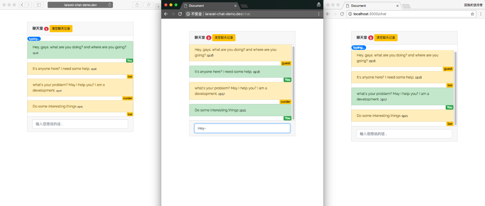

## Introduction

This project is about laravel reset-ful api demo.

```
git clone https://github.com/curder/laravel-chat-demo.git

cd laravel-chat-demo

composer install

cp .env.example .env

php artisan key:generate

touch database/database.sqlite
```

change your database connection info, and run `php artisan migrate:refresh --seed` and through by this url `http://laravel-chat-demo.dev/register`  register some new user.

## Configure 

Get some Pusher configure arguments from `https://dashboard.pusher.com/accounts/sign_in`.

```
PUSHER_APP_ID=
PUSHER_APP_KEY=
PUSHER_APP_SECRET=
PUSHER_APP_CLUSTER=
```
input them into `.env` file.

## Some Url

Chat Room: `http://laravel-chat-demo.dev/chat`
